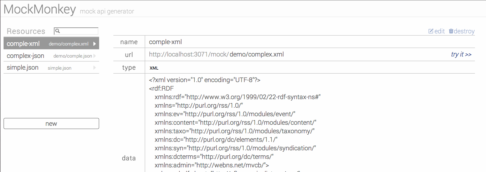

mock-monkey
======
Create your own mock API via browser.

Supported format:

+ XML
+ JSON



requirements
------
+ [Node.js](http://nodejs.org/)

quick start
------
```bash
    npm install
    node app.js
```


